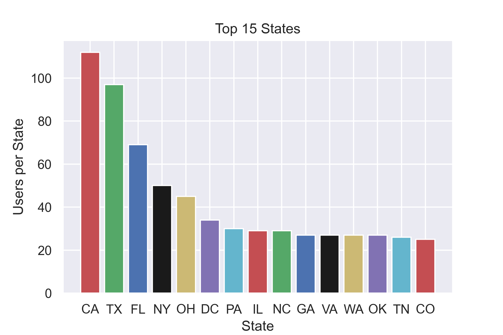
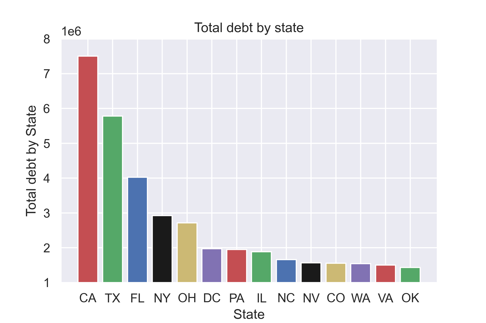
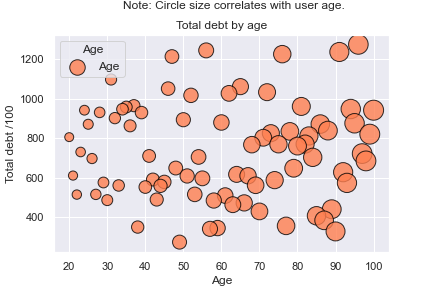
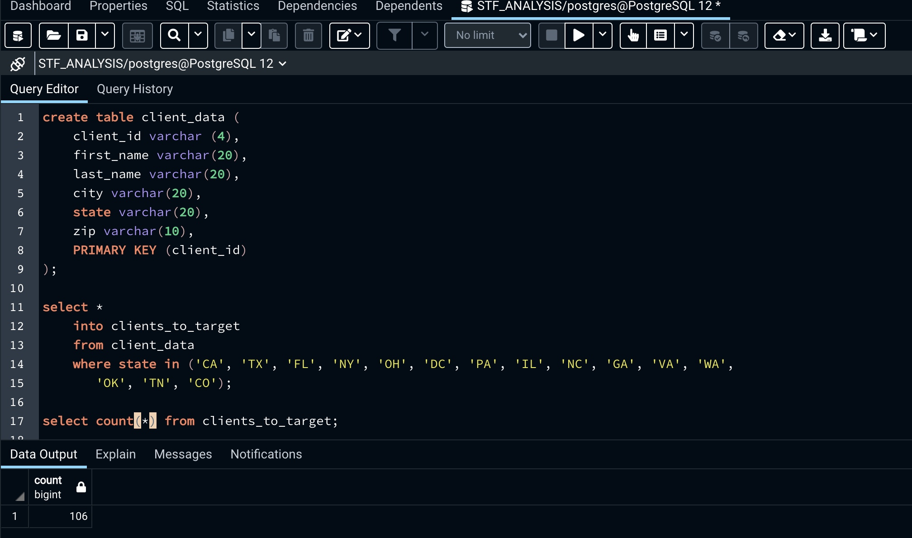

# SFS_assessment

Gary, the VP of Marketing, is looking to spend his marketing budget wisely. He’s asking you to help figure out whom to market to. Gary sent you a list of 1,000 leads that he previously marketed to (leads.csv file).

Your colleague, Ariana, sent you a list of current clients. (Current Clients.xlsx. file).

Gary has his weekly check-in with our CEO Ryan in one hour. He’s asking for a recommendation of where to spend our marketing budget based on the data available.

Please analyze the attached data sets and send your analysis to Gary along with a recommendation on which type of clients we should market to.

## Analysis

I used Python (pandas, matplotlib) and Postgres to carry out the following analysis.

After loading both the "Current Clients" and "leads_data" files into pandas, I checked the datasets for null values and made sure that every column was stored as the right data type, and used regex to get rid of special characters in the "debt" column to carry out further analysis on this column.

The leads data dataframe was grouped by gender to determine how many of the previous clients were male and female. The number of female clients was 477 and male 498. The breakdown is shown in the pie chart below. 

As we can see the amount of male and female users is pretty balanced so marketed to both female and male customers similarly. 

For the next step in the analysis, I grouped the data by state and applied a count. Then sorted the data in descending order to get the top 10 states, then created a bar chart with matplotlib. The top 10 states chart is shown below. 

As we can see, the top 15 states are also the states with the biggest population so there is a positive correlation between the size and the number of users. 

The next analysis is the breakdown of data by gender to uncover trends and determine if we should target a specific sex, based on historical data. After grouping the leads data by gender and summing the debt amount we get that the total debt amount in the female category is 29,027,030 USD and for males is 30,233,392 USD which is just a difference of 1,206,362 USD. This is a small difference and because the male sample is slightly bigger (by 21 users), it makes sense that the total debt is higher for males. Below can see a pie chart with the 
debt total by gender expressed in percentages.

The breakdown of debt by state is very similar to the top 15 state data. The total debt is directly proportional to the number of users per state and state population so California, Texas and Florida top the list. 

Lastly, analysis by age. For this analysis, the leads data was grouped by age and then I got the count of users for each group and the total debt amount. After looking at the data we can see that there is no specific age range that tends to have a higher debt and therefore become an easy and clear target. Below we can see the bubble chart of the total debt by age. The bubble size is proportional to the user's age. For scaling purposes, the total debt was divided by 1000.

## Summary 

* After grouping the leads data by gender, we can see that there is no significant difference between male and female users previously targeted; therefore, sex is not a key factor when determining whom we should target. Additionally, the total debt by gender is slightly higher for male users which we can infer is because the male sample size is slightly bigger but overall our data does not prove that one sex tends to have higher debt. 
* The data was grouped by state and the count of users is noticeably higher for the bigger states. Furthermore, the total debt amount is directly proportional to the number of users per state and state size. 
* Lastly, I grouped the leads data by age and got the total debt by age group. The data shows that there is not a specific group age that tends to have a higher debt and therefore would be a clear target. No clear pattern was found after creating a bubble chart and analyzing the data. 

## Recommendations

After finishing the exploratory analysis of the leads dataset. There was no clear pattern found of people we should target to. However, what we did learn was that based on the leads data, we had more business in certain states, specifically states with large populations. The state data is also found in the client_data dataset so I created a database with postgres and created a table and loaded the client_data file, then queried the database and got a list of 106 customers who live in the top 15 states (states most targeted to in the leads dataset or states with the highest count of clients). Then exported this as a CSV file named "clients_to_target". 

