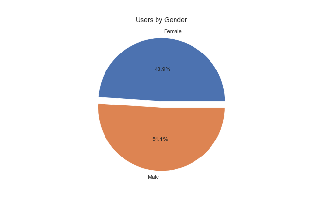
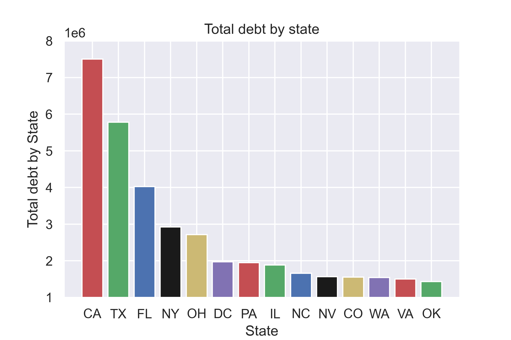

# SFS_assessment

Gary, the VP of Marketing, is looking to spend his marketing budget wisely. He’s asking you to help figure out whom to market to. Gary sent you a list of 1,000 leads that he previously marketed to (leads.csv file).

Your colleague, Ariana, sent you a list of current clients. (Current Clients.xlsx. file).

Gary has his weekly check-in with our CEO Ryan in one hour. He’s asking for a recommendation of where to spend out marketing budget based on the data available.

Please analyze the attached data sets and send your analysis to Gary along with a recommendation on which type of clients we should market to.

## Analysis

I used pandas and Postgres to carry out the analysis.

After loading both the "Current Clients" and "leads_data" files into pandas, I checked the datasets for null values and made sure that every column was stored as the riht data type and used regex to get rid of special characters in the "debt" column to carry out a further analysis on this column.

The leads data dataframe was grouped by gender to determine how many of the previous clients were male and female. The number of female clients was 477 and male 498. The breakdown is shown in the pie chart below. 

As we can see the amount of male and female users is pretty balanced so marketed to both female and male customers similarly. 

For the next step in the analysis, I grouped the data by state and applied a count. Then sorted the data in descending order to get the top 10 states, then created a bar chart with matplotlib. The top 10 states chart is shown below. 

As we can see, the top 15 states are also the states with the biggest population so there is a positive correlation between the size and the number of users. 

The next analysis is the breakdown of data by gender to uncover trends and determine if we should target a specific sex based of historical data. After grouping the leads data by gender and summing the debt amount we get that the total debt amount in the female category is 29,027,030 USD and for male is 30,233,392 USD which is just a difference of 1,206,362 USD. This is a small difference and bacause the male sample is sligthly bigger (by 21 users), it makes sense that the total debt is higher for males. Below can see a pie chart with the 
debt total by gender expressed in percentages.

The breakdown of debt by state is very similar to the top 15 states data. The total debt is directly proportional to the number of users per state and state population so California, Texas and Florida top the list. 

Lastly, 